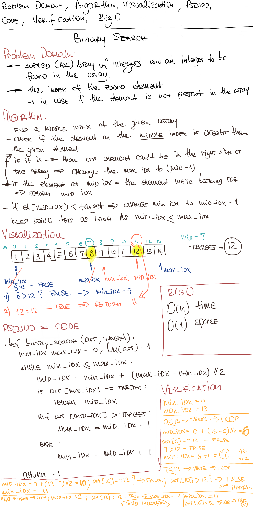

# Reverse an Array

## Challenge

Write a function which takes in 2 parameters: a sorted array and the search key. Without utilizing any of the built-in methods available to your language, return the index of the array’s element that is equal to the search key, or -1 if the element does not exist.

## Approach & Efficiency

In this solution we're setting min, mid and max indexes of the given array. Min - initially equals ot 0, max - index of the last element, mid - index of the middle element.
Then we're checking the element at the middle index against the given target, if this element is greater than the target - we're increasing min_idx to te value of mid_idx + 1, if it's less than the target - we reduce the max_idx to the value of mid_idx - 1. And we do so until element at the mid_idx is not equal to target or min_idx gets greater than max_idx (element is not present in the array).
Time complexity of this algorithm can be described as O(logn)
Space complexity - O(1)

## Solution

<a href="./array_binary_search.py">Link to code</a>
