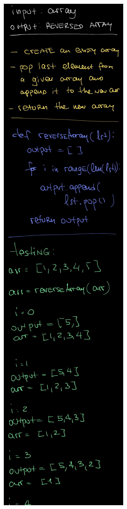
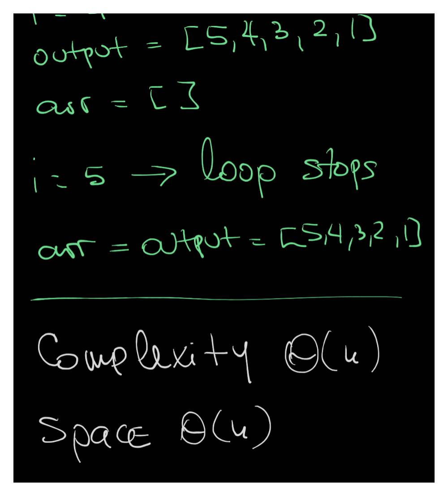
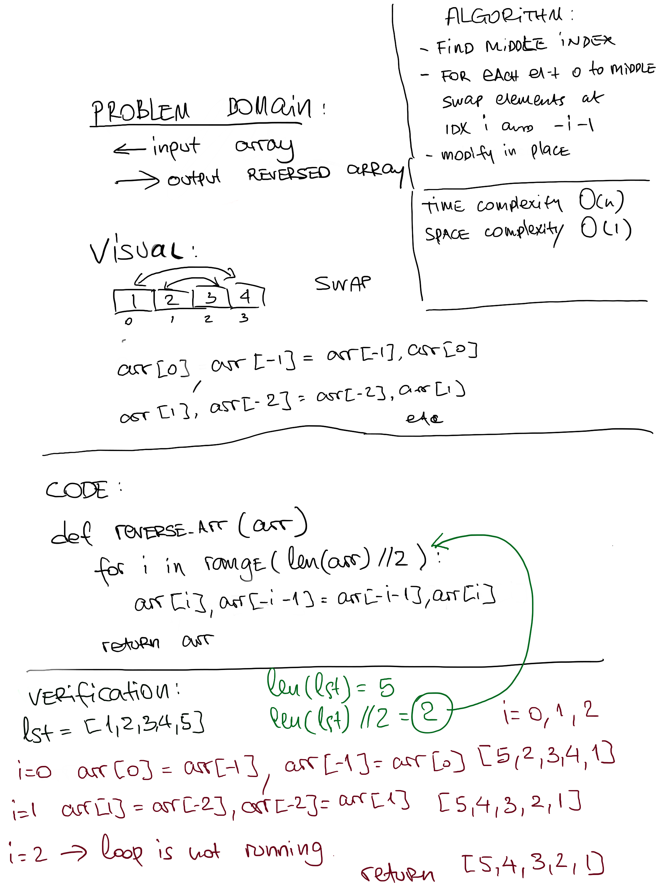

# Reverse an Array

## Challenge

Write a function which takes an array as an argument. Without utilizing any of the built-in methods available to your language, return an array with elements in reversed order.

## Approach & Efficiency

### First method

I've decided to approach this problem creating an empty list, popping the last element of a given array and appending it to the new one. It seems to be relatively memory efficient as we don't have to create a new DS in memory for each new elenemt.
This method is O(n) space and time complexity

### Second method

The second approach is by consecutively swapping first and last elements moving to the middle of the array. Since we modify the array in place this algorithm can be described as O(1) space and O(n) time

## Solution

### First method

### Second method

<a href="./array_reverse.py">Link to code</a>
