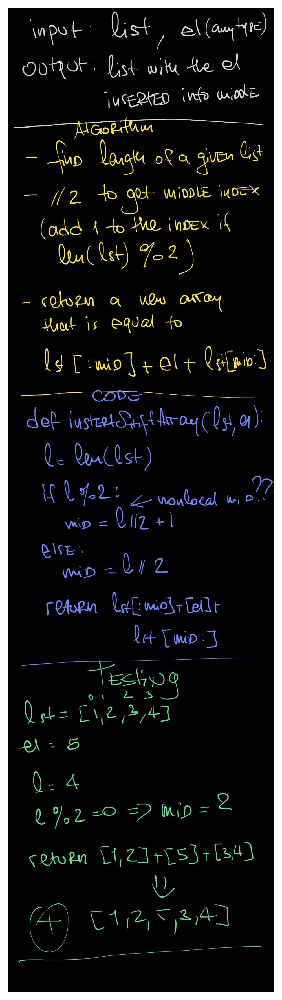

# Insert and Shift an array in middle at index

## Challenge

Write a function called insert_Shift_Array which takes in an array and the value to be added. Without utilizing any of the built-in methods available to your language, return an array with the new value added at the middle index.

## Approach & Efficiency

I approached this problem with using modulo operator to determine whether the length of a given array is even or odd. If the length is odd, we want the new element to be inserted after the bigger part of the array. Then the function just returns 2 array slices concatenated with the given element.
The efficiency of this algorithm is O(n) for both time and space

## Solution

<a href="./array_shift.py">Link to code</a>
