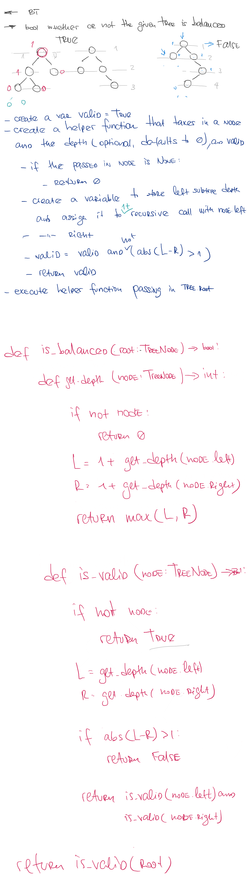

# Balanced Binary Tree

## Challenge

Given a binary tree, determine if it is height-balanced.
For this problem, a height-balanced binary tree is defined as:
a binary tree in which the left and right subtrees of every node differ in height by no more than 1.

## Approach & Efficiency

This algorithm can be described as O(n) time and O(1) space complexity

## Solution

<a href="../../challenges/balanced_binary_tree/balanced_binary_tree.py">Link to code</a>