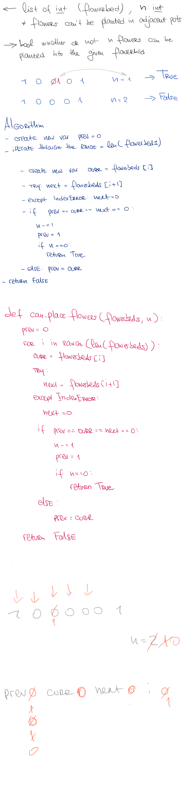

# Can Place Flowers

## Challenge

You have a long flowerbed in which some of the plots are planted, and some are not. However, flowers cannot be planted in adjacent plots.

Given an integer array flowerbed containing 0's and 1's, where 0 means empty and 1 means not empty, and an integer n, return if n new flowers can be planted in the flowerbed without violating the no-adjacent-flowers rule.

## Approach & Efficiency

The efficiency of this algorithm is O(n) time and O(1) space

## Solution

<a href="./can_place_flowers.py">Link to code</a>