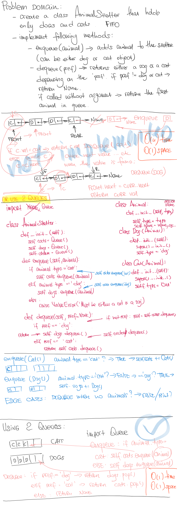

# First-in, First out Animal Shelter

## Challenge

Create a class called `AnimalShelter` which holds only dogs and cats. The shelter operates using a first-in, first-out approach.
Implement the following methods:
- `enqueue(animal)`: adds animal to the shelter. animal can be either a dog or a cat object;
- `dequeue(pref)`: returns either a dog or a cat. If pref is not "dog" or "cat" then return null.

## Approach & Efficiency

This solution uses two `Stack()` instances to implement standart `Queue()` functionality. Both `enqueue()` and `dequeue()` methods can be described as O(1) time and O(1) space complexity.

## Solution

<a href="../../challenges/fifo_animal_shelter/fifo_animal_shelter.py">Link to code</a>
