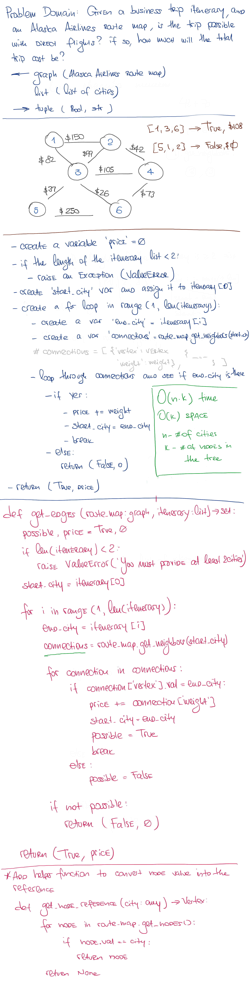

# Get Edges

## Author: _Leo Kukharau_

## Challenge

Given a business trip itinerary, and an Alaska Airlines route map, is the trip possible with direct flights? If so, how much will the total trip cost be?

## Approach & Efficiency

This solution can be described as O(n * k) time and O(k) space, where _**n**_ is a number of cities in the list, and _**k**_ is a number of nodes in the given graph.

## Solution

<a href="./get_edges.py">Link to code</a>
