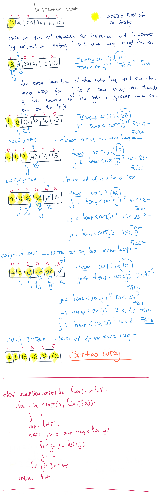

# Insert and Shift an array in middle at index

## Challenge

Implement insertion_sort algorithm

## Approach & Efficiency

This methd can be described as O(n^2) time and O(1) space complexity

## Solution

<a href="./insertion_sort.py">Link to code</a>
