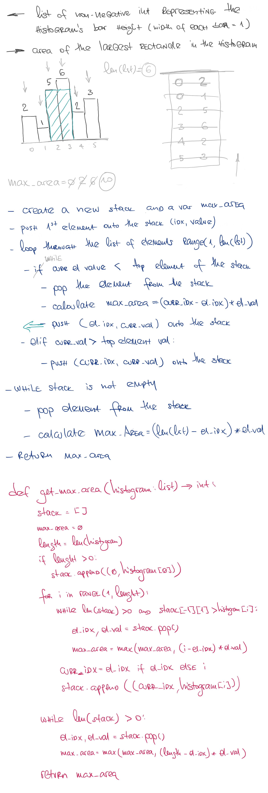

# Largest Rectangle in Histogram

## Challenge

Given n non-negative integers representing the histogram's bar height where the width of each bar is 1, find the area of largest rectangle in the histogram.

## Approach & Efficiency

This method can be described as O(n) time and O(n) space complexity

## Solution

<a href="./largest_rectangle_in_histogram.py">Link to code</a>