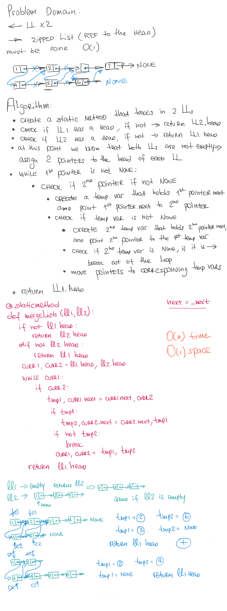

# Insert and Shift an array in middle at index

## Challenge

Write a function which takes two linked lists as arguments. Zip the two linked lists together into one so that the nodes alternate between the two lists and return a reference to the head of the zipped list. Try and keep additional space down to O(1). You have access to the Node class and all the properties on the Linked List class as well as the methods created in previous challenges.

## Approach & Efficiency

We've approached this problem using two pointers and two temp variables to hold nodes .next values. The algorithm solves the problem in one iteration over the given lists (as long as there are elements in the shortest list).
This algorithm can be described as O(n) time and O(1) space

## Solution

<a href="../../data_structures/linked_list/linked_list.py">Link to code</a>
