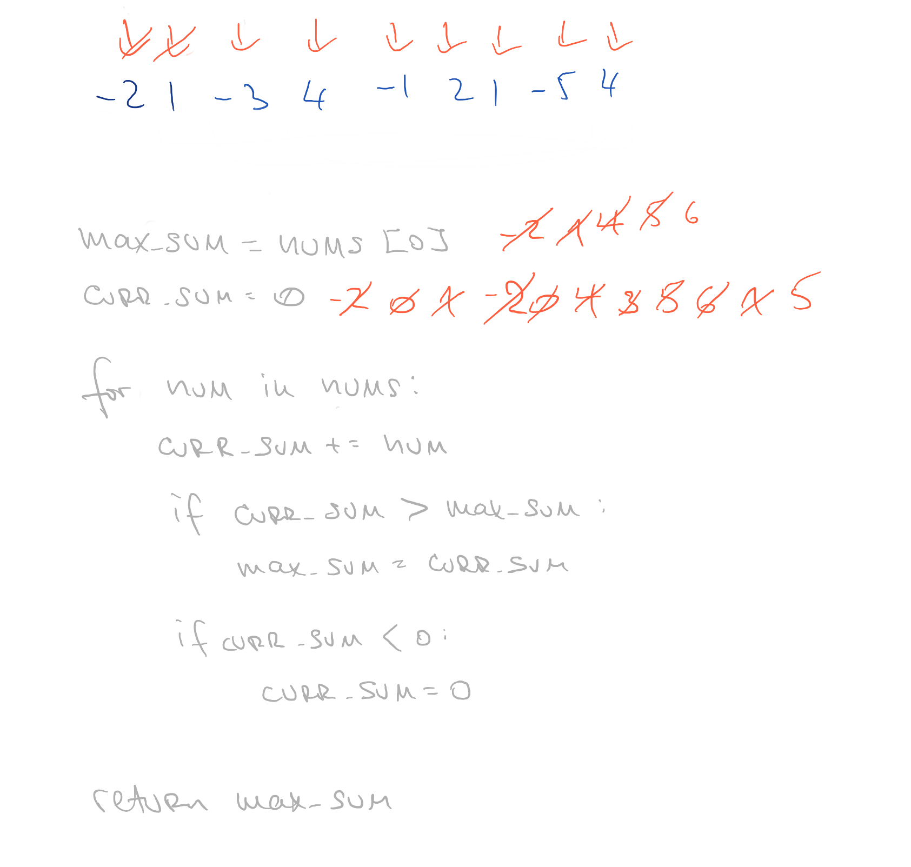

# Maximum Subarray

## Challenge

Given an integer array nums, find the contiguous subarray (containing at least one number) which has the largest sum and return its sum.

## Approach & Efficiency

This method can be described as O(n) time and O(n) space complexity

## Solution

<a href="./max_subarray.py">Link to code</a>