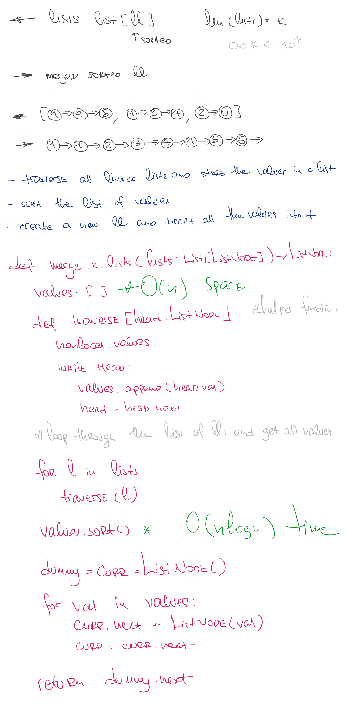

# Merge k Sorted Lists

## Challenge

You are given an array of k linked-lists lists, each linked-list is sorted in ascending order. Merge all the linked-lists into one sorted linked-list and return it.  
[See on Leetcode](https://leetcode.com/problems/merge-k-sorted-lists/)

## Approach & Efficiency

This method can be described as O(n * logn) time and O(n) space complexity

## Solution

<a href="./merge_k_sorted_lists.py">Link to code</a>