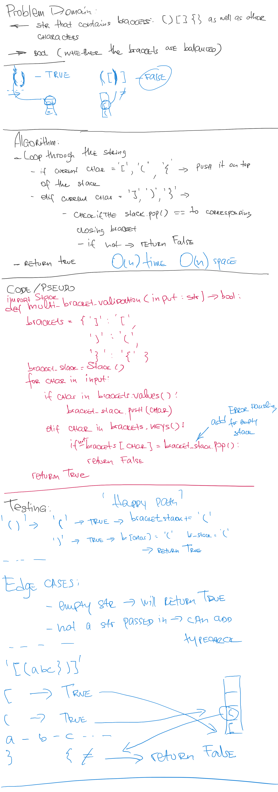

# Multi-Bracket Validation

## Challenge

Create a function which takes a string as its only argument, and returns a boolean representing whether or not the brackets in the string are balanced. There are 3 types of brackets:
- Round Brackets : ()
- Square Brackets : []
- Curly Brackets : {}

## Approach & Efficiency
I approached this problem by looping over the given string and adding all appearances of opening brackets into a Stack() instance, at the same time if we encounter a closing bracket - it will be checked against the topmost element of the stack.
This algorithms needs O(n) time to run and requires O(n) space.

## Solution

<a href="../../challenges/multi_bracket_validation/multi_bracket_validation.py">Link to code</a>
