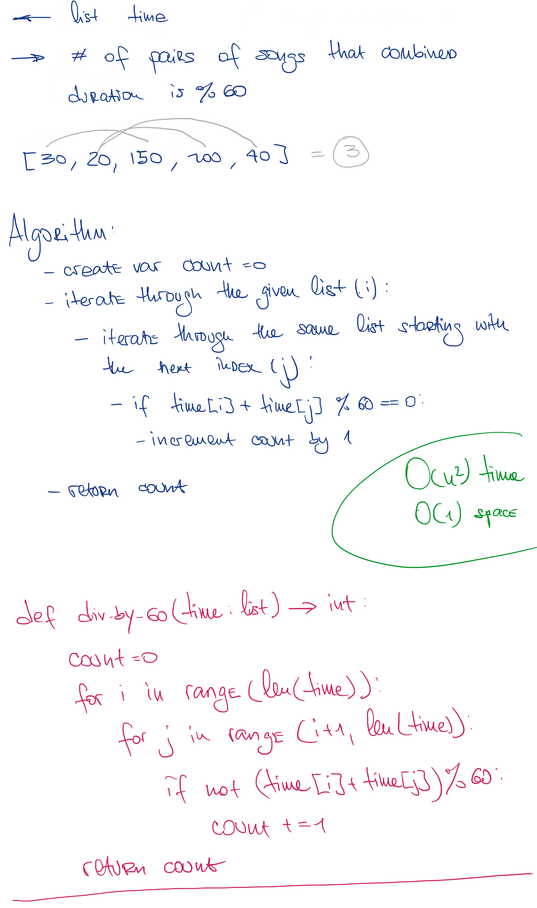

# Pairs of Songs With Total Durations Divisible by 60

## Challenge

You are given a list of songs where the ith song has a duration of time[i] seconds.

Return the number of pairs of songs for which their total duration in seconds is divisible by 60. Formally, we want the number of indices i, j such that i < j with (time[i] + time[j]) % 60 == 0.

## Approach & Efficiency

This method can be described as O(n) time and O(1) space complexity

## Solution

<a href="./pairs_of_songs.py">Link to code</a>