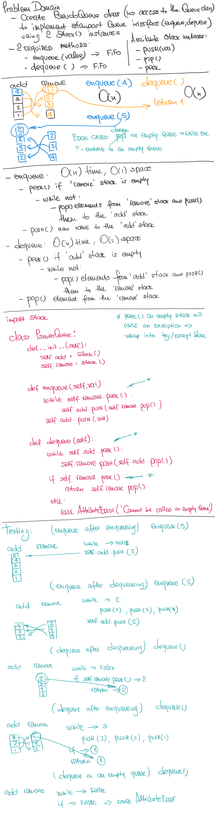

# Pseudo Queue (using 2 Stacks)

## Author: _Leo Kukharau_

## Challenge

Create a brand new `PseudoQueue` class. Do not use an existing `Queue`. Instead, this `PseudoQueue` class will implement our standard queue interface (the two methods listed below), but will internally only utilize 2 `Stack` objects. Ensure that you create your class with the following methods:

- `enqueue(value)` which inserts value into the PseudoQueue, using a first-in, first-out approach;
- `dequeue()` which extracts a value from the PseudoQueue, using a first-in, first-out approach.

## Approach & Efficiency

I've approached this problem by creating 2 Stack() instances (for adding and removing elements). Each time we need to enqueue an item - we will check if there are any items in 'remove' stack, and if yes - we'll move all of them into the 'add' stack, which will reverse their order and allow us to enqueue the new item in the correct place. Same idea with the dequeue method.
Both of these methods can be described as O(n) time and O(1) space

## API

- `.enqueue(animal)` - takes in an animal object as an argument and adds it to the queue;
- `.dequeue(preference)` - takes in a preference and returns the first preferred animal from the queue;

## Solution

<a href="./queue_with_stacks.py">Link to code</a>
