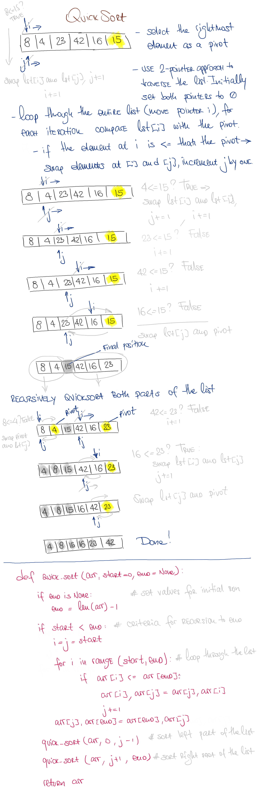

# Quick Sort

## Challenge

Implement quick_sort algorithm

## Approach & Efficiency

This methd can be described as avg O(n logn) (O(n2) worst case) time and O(1) space complexity

## Solution

<a href="./quick_sort.py">Link to code</a>
