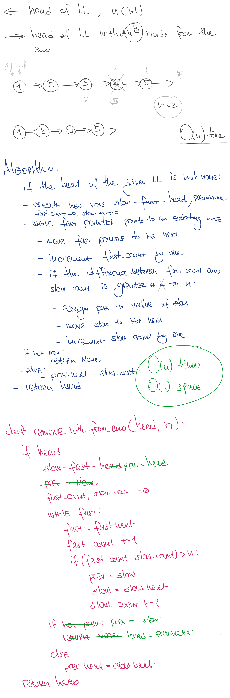

# Remove Nth Node From End of List

## Challenge
[See on Leetcode](https://leetcode.com/problems/remove-nth-node-from-end-of-list/)  

Given the head of a linked list, remove the nth node from the end of the list and return its head.

## Approach & Efficiency

This method can be described as O(n) time and O(1) space complexity

## Solution

<a href="./remove_nth_from_end.py">Link to code</a>