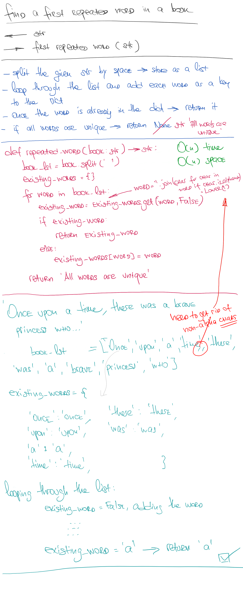

# Repeated Word

## Challenge

- Write a function that accepts a lengthy string parameter.
- Without utilizing any of the built-in library methods available to your language, return the first word to occur more than once in that provided string.

## Approach & Efficiency

This method can be described as O(n) time and O(n) space complexity

## Solution

<a href="./repeated_word.py">Link to code</a>
