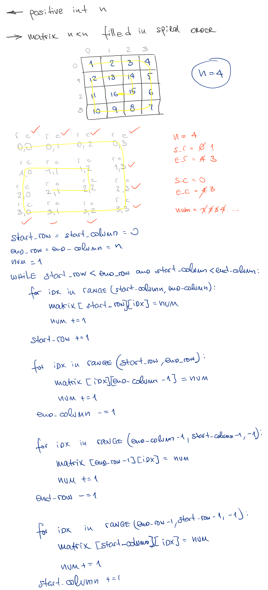

# Spiral Matrix

## Challenge

Given a positive integer n, generate an n x n matrix filled with elements from 1 to n2 in spiral order.

## Approach & Efficiency

This method can be described as O(n2) time and O(n2) space complexity

## Solution

<a href="./spiral_matrix.py">Link to code</a>