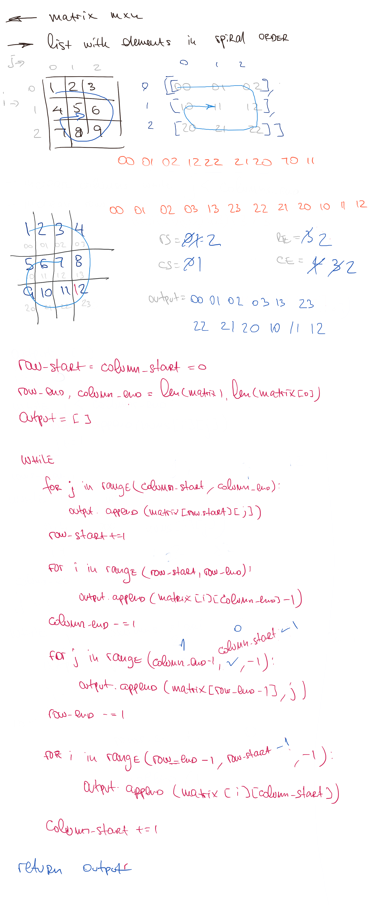

# Spiral Matrix I

## Challenge

Given an m x n matrix, return all elements of the matrix in spiral order

## Approach & Efficiency

This method can be described as O(n) time and O(n) space complexity where n is the number of elements in the given matrix

## Solution

<a href="./spiral_matrix_i.py">Link to code</a>