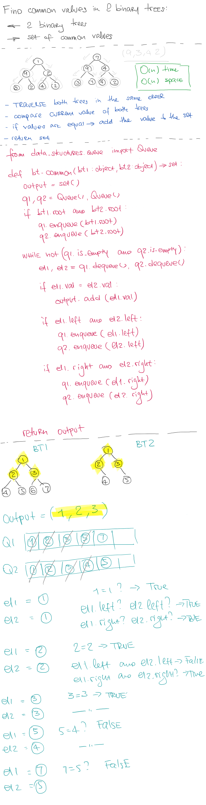

# Tree Intersection

## Challenge

- Write a function called tree_intersection that takes two binary tree parameters.
- Without utilizing any of the built-in library methods available to your language, return a set of values found in both trees.

## Approach & Efficiency

This method can be described as O(n) time and O(n) space complexity

## Solution

<a href="./tree_intersection.py">Link to code</a>
