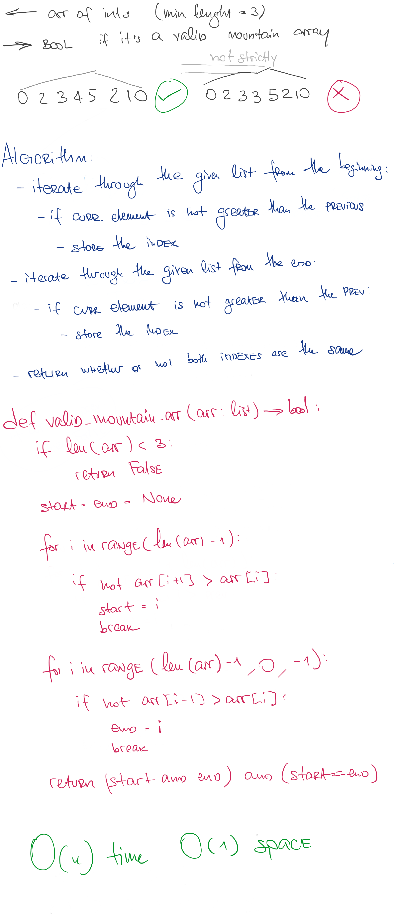

# Valid Mountain Array

## Challenge

Given an array of integers arr, return true if and only if it is a valid mountain array.

Recall that arr is a mountain array if and only if:

arr.length >= 3
There exists some i with 0 < i < arr.length - 1 such that:
arr[0] < arr[1] < ... < arr[i - 1] < A[i]
arr[i] > arr[i + 1] > ... > arr[arr.length - 1]
## Approach & Efficiency

This method can be described as O(n) time and O(1) space complexity

## Solution

<a href="./valid_mountain_array.py">Link to code</a>