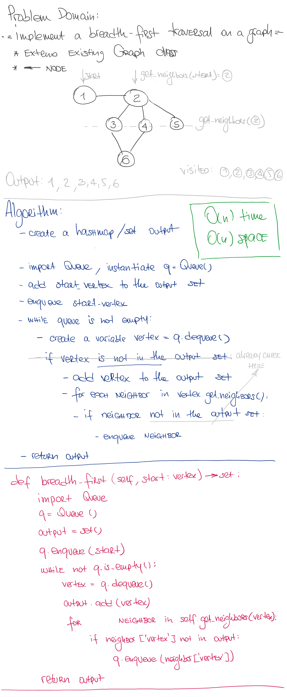
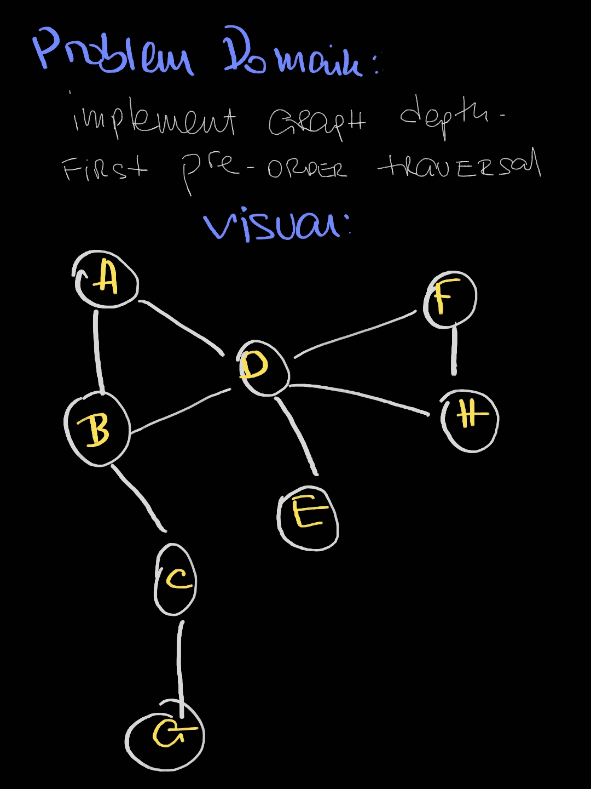
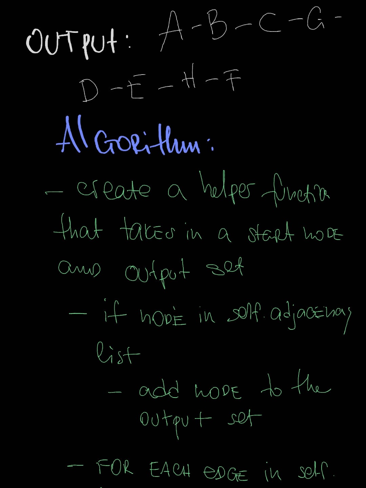
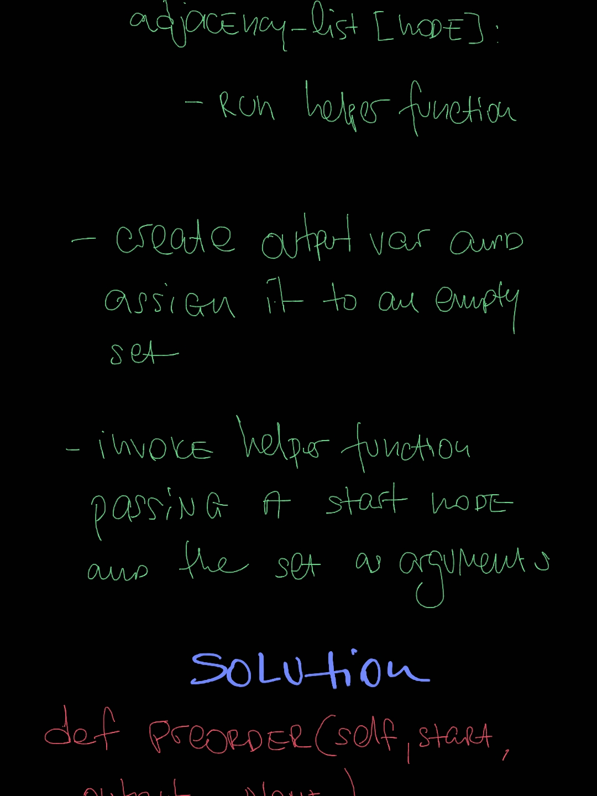
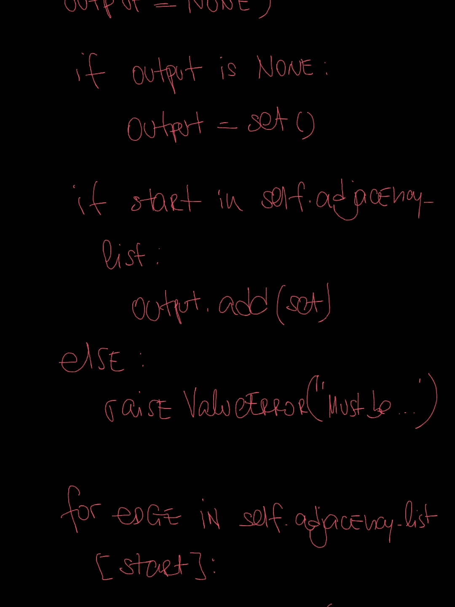
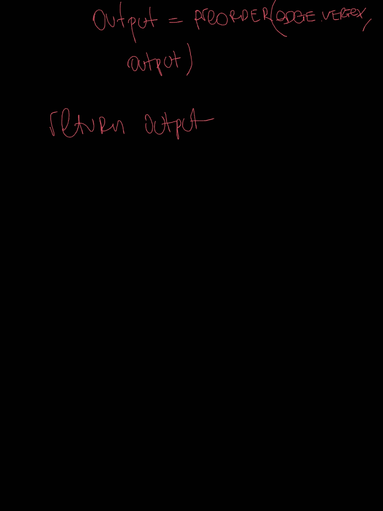

# Implementation: Graphs

## Author: _Leo Kukharau_

## Challenge

- `AddNode()`:
    - Adds a new node to the graph
    - Takes in the value of that node
    - Returns the added node
- `AddEdge()`:
    - Adds a new edge between two nodes in the graph
    - Include the ability to have a “weight”
    - Takes in the two nodes to be connected by the edge
    - Both nodes should already be in the Graph
- `GetNodes()`:
    - Returns all of the nodes in the graph as a collection (set, list, or similar)
- `GetNeighbors()`:
    - Returns a collection of edges connected to the given node
    - Takes in a given node
    - Include the weight of the connection in the returned collection
- `Size()`:
    - Returns the total number of nodes in the graph
- `Breadth_first()`:
    - Traverses a graph in breadth-first manner and returns a set of Vertices
- `Pre_order()`:
    - Traverses a graph in depth-first pre-order manner and returns a set of Vertices

<a href="./graph.py">Link to code</a>
