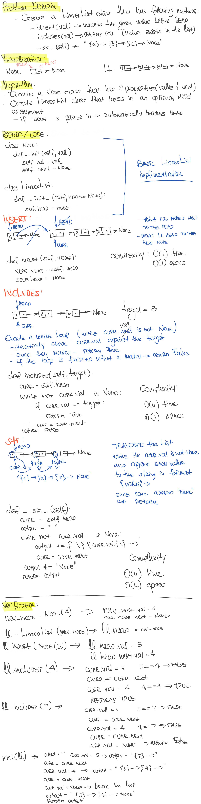
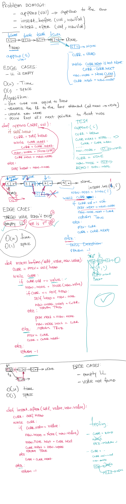
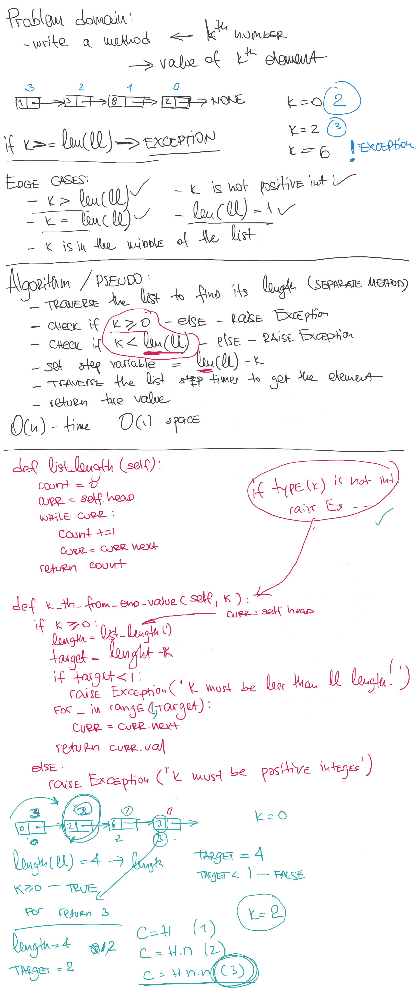

# Implementation: Singly Linked Lists

Linked List is a linear data structure.
It is a series of connected "nodes" that contains the "address" of the next node. Each node can store a data point which may be a number, a string or any other type of data.

## Author: _Leo Kukharau_ and _Thomas Sherer_

## Challenge

Create a Node classs and LinkedList class that will have a singly linked list properties including:

- prepend an element to the beginning of the linked list;
- check if the given element exists in the list;
- print all list elements as a string in a given format;
- add a new node with the given value to the end of the list;
- add a new node with the given newValue immediately before the first value node;
- add a new node with the given newValue immediately after the first value node;
- write a method for the Linked List class which takes a number `k` as a parameter. Return the node’s value that is `k` from the end of the linked list.

## Approach & Efficiency

- `insert()` can be described as O(1) time and O(1) space;
- `includes()` can be described as O(n) time and O(1) space;
- `__str__()` can be described as O(n) time and O(n) space;
- `append()` can be described as O(n) time and O(1) space;
- `insert_before()` can be described as O(n) time and O(1) space;
- `insert_after()` can be described as O(n) time and O(1) space;
- `ll_len()` can be described as O(n) time and O(1) space;
- `kth_from_end_val()` can be described as O(n) time and O(1) space;

## API

- `.insert()` - takes in any value as an argument prepends a new node with that value to the head of the list;
- `.includes()` - takes in any value as an argument and returns a boolean result depending on whether that value exists in the list;
- `.__str__()` - takes in no arguments and returns a string representing all the values in the Linked List;
- `append()` adds a new node with the given value to the end of the list;
- `insert_before()` which add a new node with the given newValue immediately before the first value node;
- `insert_after()` which add a new node with the given newValue immediately after the first value node;
- `ll_len()` which returns the length of LL;
- `kth_from_end_val()` which takes a number k as a parameter and returns the node’s value that is k from the end of the linked list;

## Solution (Singly Linked List)

## Solution (Linked List Insertions)

## Solution (Linked List k-th Value from the end)

<a href="./linked_list.py">Link to code</a>
