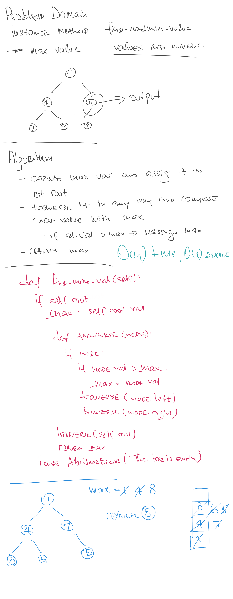
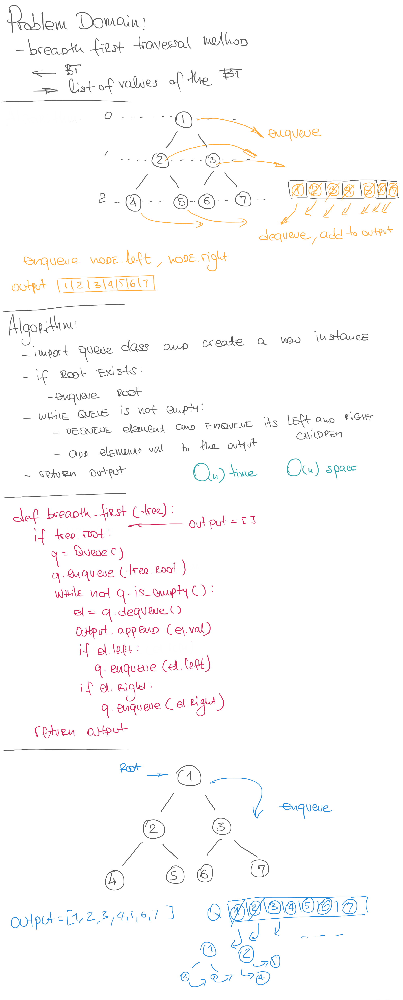

# Implementation: Tree

## Author: _Leo Kukharau_

## Challenge

- Create a `Node` class that has properties for the value stored in the node, the `left` child node, and the `right` child node.
- Create a `BinaryTree` class
  - Define a method for each of the depth first traversals called `preOrder`, `inOrder`, and `postOrder` which returns an array of the values, ordered appropriately.
- Any exceptions or errors that come from your code should be semantic, capturable errors. For example, rather than a default error thrown by your language, your code should raise/throw a custom, semantic error that describes what went wrong in calling the methods you wrote for this lab.

- Create a `BinarySearchTree` class
  - Define a method named `add` that accepts a value, and adds a new node with that value in the correct location in the binary search tree.
  - Define a method named `contains` that accepts a value, and returns a boolean indicating whether or not the value is in the tree at least once.

## Approach & Efficiency

- class `BinaryTree`:

  - `.add(value)` - O(n) time, O(1) space;
  - `.contains(value)` - O(n) time, O(1) space;
  - `.pre_order()` - O(n) time, O(n) space;
  - `.in_order()` - O(n) time, O(n) space;
  - `.post_order()` - O(n) time, O(n) space;
  - `.breadth_first()` - O(n) time, O(n) space;
  - `.max_val()` - O(n) time, O(1) space;

- class `BinareSearchTree`:
  - `.add()` - O(n) time, O(1) space;

## API

- class `Node` - Class for the Node instances
- class `BinaryTree` - which implements Stack data structure with its common methods

  - `.add(value)` - Method takes any value as an argument and adds it to the tree (uses breadth-first approach);
  - `.contains(value)` - Method takes any value as an argument and returns whether or not this value is present in the tree;
  - `.pre_order()` - Method takes no arguments and returns a list of values of the tree in root >> left >> right order;
  - `.in_order()` - Method takes no arguments and returns a list of values of the tree in left >> root >> right order;
  - `.post_order()` - Method takes no arguments and returns a list of values of the tree in left >> right >> root order;
  - `.breadth_first()` - Method takes no arguments and returns a list of values of the tree in breadth-first manner;
  - `.max_val()` - Method takes no arguments and returns the maximum value of the tree;

- class `BinareSearchTree` - which inherits after `BinaryTree` class

  - `.add()` - Method takes any value as an argument and adds it to the tree (values that are strictly less than the root - got to the left, the rest - to the right);

  
  

<a href="./tree.py">Link to code</a>
